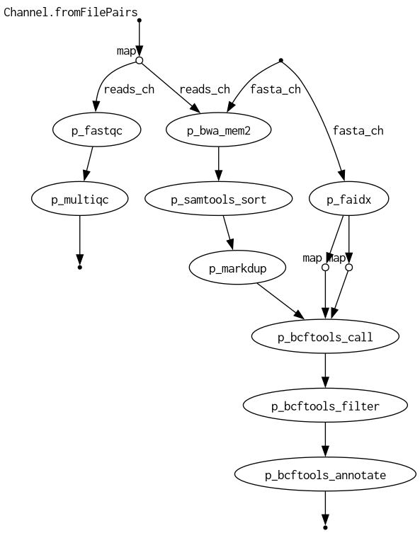

# 🧬 NGS Variant Detection Pipeline (Nextflow)

Small, reproducible **NGS variant calling** pipeline in **Nextflow DSL2**.
From paired-end **FASTQ** to **aligned BAM**, **filtered & annotated VCF**, and a unified **MultiQC** report.
Containers: **BWA-MEM2, Samtools, Picard, BCFtools, MultiQC** (BioContainers on Docker).

---

## 📸 Pipeline overview

> Static diagram (kept in the repo for quick viewing)



> Mermaid diagram (rendered by GitHub)

```mermaid
flowchart TD
    subgraph QC
        A[FASTQ (R1/R2)] --> B[FastQC]
    end

    subgraph Alignment
        A --> C[BWA-MEM2 Alignment]
        C --> D[SAMtools Sort]
        D --> E[Picard MarkDuplicates]
        E --> F[BAM marked & indexed]
    end

    subgraph VariantCalling
        F --> G[bcftools mpileup]
        G --> H[bcftools call]
        H --> I[bcftools norm]
        I --> J[bcftools filter]
        J --> K[bcftools annotate]
    end

    subgraph StatsAndReport
        K --> L[bcftools stats]
        B --> M[MultiQC]
        L --> M
        M --> N[MultiQC Report (HTML)]
    end
```


🗂 Project layout
.
├── main_final.nf            # pipeline (DSL2)
├── pipeline.png             # overview figure (used above)
├── data/                    # demo FASTQs (paired-end)
├── ref/                     # reference FASTA (e.g. ref_demo.fasta)
├── results/                 # outputs (BAM, VCF, MultiQC)
├── conf/                    # optional Nextflow configs
├── .gitignore               # excludes data/tmp/work, etc.
└── README.md

✅ Requirements

Nextflow ≥ 23
Docker running (BioContainers are pulled automatically)
If you have Graphviz installed, Nextflow can render the DAG directly (see Figures).

▶️ Quick start

Run on the demo data:
nextflow run main_final.nf -profile docker \
  --reads 'data/*_{R1,R2}.fastq.gz' \
  --fasta ref/ref_demo.fasta \
  --outdir results \
  --use_snpeff false --use_vep false

Common flags:

-resume to continue a previous run

-with-report results/timeline.html (timeline)

-with-dag results/pipeline.svg (DAG, requires Graphviz)

⚙️ Parameters
| Param          | Default                   | Description                                  |
| -------------- | ------------------------- | -------------------------------------------- |
| `--reads`      | `data/*_{R1,R2}.fastq.gz` | Paired-end FASTQ glob                        |
| `--fasta`      | `ref/ref_demo.fasta`      | Reference FASTA                              |
| `--outdir`     | `results`                 | Output folder                                |
| `--use_snpeff` | `false`                   | Enable snpEff annotation                     |
| `--use_vep`    | `false`                   | Enable VEP annotation (offline cache needed) |
| `--min_qual`   | `20`                      | Min variant QUAL                             |
| `--min_dp`     | `1`                       | Min read depth                               |
| `--max_dp`     | `10000`                   | Max read depth                               |
| `--min_af`     | `0.0`                     | Min allele frequency                         |
| `--bwa_opts`   | `-k 5 -T 0`               | Extra BWA-MEM2 options (demo-friendly)       |

Enable either --use_snpeff true or --use_vep true (not both).
For VEP, set --vep_cache_dir, --vep_species, --vep_assembly.

📤 Outputs

Alignment
results/sample.sam
results/sample.sorted.bam(.bai)
results/sample.marked.bam(.bam.bai)
Variants
results/vcf/sample.raw.vcf
results/vcf/sample.norm.vcf
results/vcf/sample.filtered.vcf
results/vcf/sample.annotated.vcf (bcftools +fill-tags)
results/vcf/sample.bcfstats.txt

QC

results/fastqc/*_fastqc.zip
results/multiqc/multiqc_report.html
Open MultiQC:
open results/multiqc/multiqc_report.html   # macOS
# xdg-open results/multiqc/multiqc_report.html  # Linux

🖼 Figures
1) Execution DAG (auto-generated)

If Graphviz is available:
nextflow run main_final.nf -profile docker \
  --reads 'data/*_{R1,R2}.fastq.gz' \
  --fasta ref/ref_demo.fasta \
  --outdir results \
  -with-dag results/pipeline.svg

This creates results/pipeline.svg — you can commit it or link it in the README:


2) MultiQC report

After a run, you’ll find results/multiqc/multiqc_report.html with:
FastQC metrics per sample
BCFtools stats (counts, Ts/Tv, indel length)
Aggregated “General Statistics” table

🔬 Notes for reviewers

The demo FASTQs are tiny, designed to run in seconds and still produce:
Non-empty BAM with all reads mapped
Non-empty VCF (or at least bcftools stats present)
MultiQC report without “Error – was not able to plot data”
Read groups are injected into BWA-MEM2 (-R) to keep Picard happy.

🧪 Reproducibility

All steps run in pinned BioContainers:
bwa-mem2:2.2.1
samtools:1.20
picard:3.2.0
bcftools:1.20
multiqc:1.19
Specify -profile docker to isolate environments and ensure reproducible results.

📝 License

MIT — see LICENSE (add your preferred license)

👩‍💻 Author

Chiara Tarenghi — Biomedical Science & Biomedical Engineering
Feedback and PRs are welcome!
